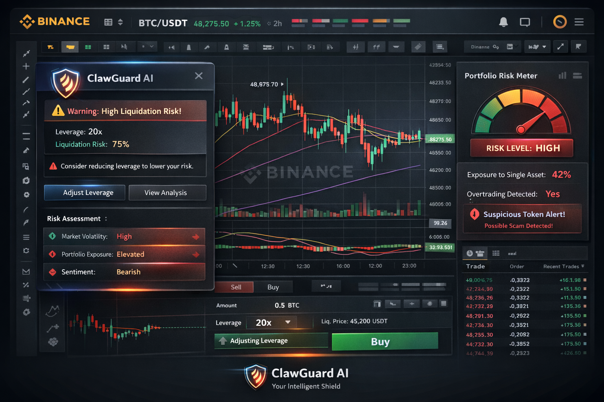

# clawguard-ai
ClawGuard AI is a real-time risk intelligence assistant integrated with Binance, designed to protect traders from high-risk decisions using AI-powered alerts, behavioral analysis, and portfolio monitoring.
# 🛡️ ClawGuard AI

## 🚀 Tagline
- Trade smarter. Stay protected.  
- Your intelligent shield in crypto.  
- Guard your trades. Grow your portfolio.  

---

## 🔥 Core Concept

ClawGuard AI is a real-time risk intelligence and trading assistant designed to protect traders from costly mistakes while improving decision-making.

---

## ⚙️ Key Features

### 🚨 Smart Risk Alerts
- Detects high liquidation risk (futures)  
- Flags overexposure to a single asset  
- Warns against volatile entries  

### 🧠 Behavior Analysis Engine
- Identifies emotional trading patterns:
  - FOMO buying  
  - Panic selling  
  - Overtrading  
- Provides corrective suggestions to improve trading discipline  

### 🛡️ Scam & Threat Detection
- Flags suspicious tokens and contracts  
- Detects phishing links  
- Provides wallet risk scoring  

### 📊 Portfolio Health Dashboard
- Risk heatmap (low → extreme)  
- Diversification score  
- Volatility exposure insights  

### 🤖 AI Trade Assistant
- Pre-trade analysis (“This trade has high downside risk”)  
- Suggests better entry and exit zones  
- Provides confidence scoring for decisions  

---

## 🎯 Unique Selling Proposition

Most tools help you make money.  
**ClawGuard AI helps you not lose it first.**

---

## 🎬 Demo Flow

1. User attempts to place a risky trade  
2. ClawGuard AI detects high risk  
3. Displays risk breakdown (liquidation, volatility, sentiment)  
4. Suggests a safer alternative  
5. User adjusts the trade  
6. Dashboard updates with improved risk level  

---

## 🎨 Visual Concept

- Dark trading interface (Binance-style)  
- Glowing AI shield icon 🛡️  
- Red (risk) → Green (safe) transition  
- Real-time charts with AI overlays  
- Futuristic assistant UI  

---

## 🔗 Integration

ClawGuard AI integrates with Binance APIs to:
- Analyze user portfolios  
- Monitor live market data  
- Provide real-time risk insights  

---

## 🔐 Security

- Uses read-only API access  
- Does not execute trades or withdraw funds  
- Focused on analysis and protection  

---

## 🌍 Vision

To become the intelligent safety layer for crypto traders—helping millions trade with confidence, discipline, and reduced risk.

---

## 📌 Status

🚧 Prototype / Hackathon Project  

---

## 📽️ Demo

👉 Add your demo video link here  

---

## 🔗 Repository

👉 Add your GitHub repo link here  
